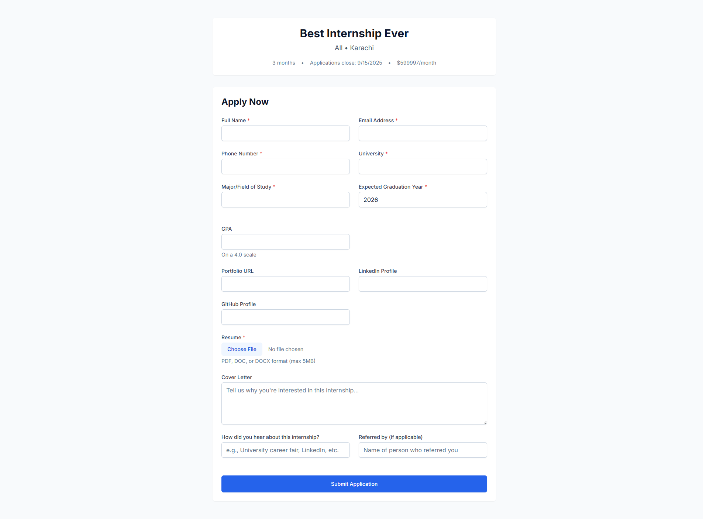

# HCM - Human Capital Management System

[](https://nodejs.org/)
[](https://reactjs.org/)
[](https://www.typescriptlang.org/)
[](https://www.mongodb.com/)
[](https://expressjs.com/)
[](https://tailwindcss.com/)

A comprehensive **Human Capital Management (HCM)** system built with modern web technologies, featuring employee management, leave management, attendance tracking, team management, and a complete **Internship Management System**.

## 🚀 Features Overview

### 🏢 Core HR Management
- **Employee Management** - Complete employee lifecycle management
- **Team Organization** - Department and team structure management  
- **Attendance Tracking** - Daily attendance monitoring and reporting
- **Leave Management** - Leave requests, approvals, and balance tracking
- **Dashboard Analytics** - Real-time HR insights and metrics
- **Role-Based Access Control** - Admin, HR, Manager, and Employee roles

### 🎓 Internship Management System
- **Public Application Portal** - Student-facing application forms
- **Program Management** - Create and manage internship programs
- **Application Processing** - Review, track, and manage applications
- **Email Automation** - Automated notifications and communications
- **File Management** - Resume uploads and document handling
- **Analytics & Reporting** - Application trends and program insights

## 🛠 Tech Stack

### Backend
- **Runtime:** Node.js 18+
- **Framework:** Express.js with TypeScript
- **Database:** MongoDB with Mongoose ODM
- **Authentication:** JWT (JSON Web Tokens)
- **File Upload:** Multer with type validation
- **Email Service:** Nodemailer
- **Security:** bcryptjs, CORS

### Frontend  
- **Framework:** React 18 with TypeScript
- **Build Tool:** Vite for fast development
- **Routing:** React Router v6
- **Styling:** TailwindCSS + Headless UI
- **Icons:** Heroicons
- **HTTP Client:** Axios
- **State Management:** React Context API

### Development Tools
- **Language:** TypeScript for type safety
- **Linting:** ESLint with TypeScript support  
- **Process Management:** Concurrently for dev environment
- **Hot Reload:** Nodemon + Vite HMR

## 📋 User Roles & Permissions

### 🔴 Admin
- **Full System Access** - All features and data
- **User Management** - Create, edit, delete users
- **Employee Management** - Complete employee lifecycle
- **Internship Programs** - Create, edit, delete programs
- **Application Management** - Review all applications
- **System Configuration** - Global settings and permissions

### 🟣 HR (Human Resources)
- **Employee Management** - Add, edit, view employees  
- **Leave Management** - Approve/reject leave requests
- **Attendance Reports** - Generate attendance analytics
- **Internship Programs** - Create and manage programs
- **Application Review** - Process internship applications
- **Team Coordination** - Cross-team employee access

### 🔵 Manager
- **Team Management** - Manage assigned team members
- **Leave Approvals** - Approve team leave requests
- **Team Reports** - View team attendance and performance
- **Limited Employee Edit** - Basic team member updates
- **Internship Review** - Review applications for team positions

### 🟢 Employee
- **Personal Profile** - View and edit own information
- **Leave Requests** - Submit and track leave applications
- **Attendance** - View own attendance records
- **Team Directory** - View team member information
- **Read-Only Access** - Limited to personal and team data

## 🚀 Quick Start

### Prerequisites
- Node.js 18+ installed
- MongoDB 6+ installed and running
- Git for version control

### 📥 Installation

1. **Clone the repository:**
```bash
git clone https://github.com/jazil10/HCM.git
cd HCM
```

2. **Install dependencies:**
```bash
npm run install:all
```

3. **Environment Setup:**

Create `.env` file in the `/backend` directory:
```env
NODE_ENV=development
PORT=5000
MONGODB_URI=mongodb://localhost:27017/hcm
JWT_SECRET=your_super_secure_jwt_secret_key_here
JWT_EXPIRE=30d

# Email Configuration (Optional - for notifications)
EMAIL_HOST=smtp.gmail.com
EMAIL_PORT=587
EMAIL_USER=your-email@gmail.com
EMAIL_PASS=your-app-password
EMAIL_FROM=noreply@yourcompany.com
```

## 📋 Available Commands

### Main Commands
- `npm run dev` - Start both backend and frontend in development
- `npm run start` - Start both in production mode  
- `npm run build` - Build both for production
- `npm run seed` - Seed database with sample data
- `npm run migrate` - Run database migrations

### Individual Commands  
- `npm run dev:backend` - Start only backend
- `npm run dev:frontend` - Start only frontend
- `npm run install:all` - Install all dependencies

### Utility Scripts
- `npm run screenshots` - Auto-capture screenshots for documentation
- For more scripts, see: [`scripts/README.md`](./scripts/README.md)

## ✨ Features

### Core HR Features
- **Employee Management** - Add, edit, and manage employee records
- **Team Management** - Organize employees into teams with managers  
- **Attendance Tracking** - Monitor employee attendance and work hours
- **Leave Management** - Handle leave requests, approvals, and balance tracking
- **Dashboard & Analytics** - Comprehensive insights into HR metrics

### 🎓 Internship Management System
- **Program Creation** - HR/Admin can create detailed internship programs
- **Public Application Forms** - Students can apply through public URLs
- **Application Review** - Comprehensive dashboard to review applications
- **Status Tracking** - Track applications through various stages
- **Communication** - Email notifications and internal notes
- **File Management** - Resume uploads and document handling

## � Screenshot Gallery

### 🔐 Authentication System

*Modern login interface with split-screen design, company branding, and password visibility toggle*

### 📊 Dashboard Overview

*Main dashboard featuring real-time statistics, recent activity feed, and role-based quick actions*

### 👥 Employee Management

*Employee management with beautiful card layout, advanced filtering, and search capabilities*

### 🏢 Team Management

*Team management dashboard with card-based layout showing team statistics and member information*

### 📅 Leave Management System

*Leave management system with request workflow, status tracking, and approval processes*

### ⏰ Attendance Tracking

*Real-time attendance tracking with statistics, analytics, and reporting capabilities*

### 🎓 Internship Management

*Internship program management with creation, editing, and application tracking*


*Student-facing application portal with dynamic forms, file uploads, and mobile optimization*

## �🛠 Tech Stack

**Backend:** Node.js, Express, TypeScript, MongoDB, JWT, Multer, Nodemailer  
**Frontend:** React 18, TypeScript, Vite, React Router, Tailwind CSS, Headless UI

### Architecture Overview
- **Modern UI** - React with Tailwind CSS for responsive design
- **Type Safety** - Full TypeScript implementation
- **Secure Authentication** - JWT-based with role-based access control
- **Database** - MongoDB with Mongoose ODM
- **Email Integration** - Nodemailer for notifications
- **File Handling** - Multer for secure file uploads

## 📱 Detailed Features by Module

### 👥 Employee Management
- **Complete Profile System** - Personal info, role assignment, team allocation
- **Advanced Search & Filtering** - Multi-criteria employee discovery
- **Profile Photos** - Upload and manage employee pictures
- **Role-Based Access** - Different permissions per user role
- **Relationship Tracking** - Manager-employee relationships

### 🏢 Team Management  
- **Department Organization** - Multi-level team structure
- **Manager Assignment** - Clear reporting hierarchy
- **Team Analytics** - Member statistics and performance
- **Cross-Team Visibility** - Inter-departmental collaboration

### 📅 Leave Management System
- **Multiple Leave Types** - Annual, sick, personal, emergency, maternity/paternity
- **Balance Tracking** - Automatic calculation of available days
- **Approval Workflow** - Multi-level approval with email notifications
- **Calendar Integration** - Visual planning and conflict detection
- **Policy Enforcement** - Configurable rules and restrictions

### ⏰ Attendance Tracking
- **Real-Time Monitoring** - Live attendance status
- **Statistics Dashboard** - Daily, weekly, monthly analytics  
- **Late Arrival Tracking** - Automated detection and reporting
- **Export Capabilities** - Data export for payroll systems

### 🎓 Internship Management System

#### Program Management (HR/Admin)
- **Rich Program Creation** - Detailed program information
- **Custom Application Forms** - Dynamic form builder
- **Public URL Generation** - SEO-friendly application links
- **Status Workflow** - Draft → Active → Closed → Archived
- **Deadline Management** - Automated notifications

#### Student Portal
- **Mobile-Responsive** - Apply from any device
- **File Upload System** - Secure resume submission
- **Progress Tracking** - Real-time completion status
- **Auto-Save Feature** - Never lose application data
- **Confirmation System** - Email receipts and tracking

#### Application Review Dashboard
- **Advanced Filtering** - Search by program, status, date
- **Bulk Operations** - Mass status updates
- **Internal Notes** - Collaborative review process
- **Direct Communication** - Email applicants from platform
- **Analytics** - Application trends and conversion rates

## 🔐 Security & Performance

### Security Features
- **JWT Authentication** - Secure token-based auth
- **Password Hashing** - bcryptjs encryption
- **Input Validation** - Server-side validation
- **File Upload Security** - Type and size restrictions
- **Role-Based Access** - Granular permissions

### Performance Optimizations
- **Code Splitting** - Optimized bundle sizes
- **Lazy Loading** - On-demand resource loading
- **Database Indexing** - Optimized queries
- **Responsive Design** - Mobile-first approach

## 🚀 Development Guide

### Available Scripts
```bash
# Main Commands
npm run dev              # Start both frontend and backend
npm run build           # Build for production
npm run start          # Start production servers
npm run seed           # Populate database with sample data

# Individual Services
npm run dev:frontend   # React development server
npm run dev:backend    # Express server with nodemon
npm run install:all    # Install all dependencies
```

### API Documentation

#### Authentication
- `POST /api/auth/login` - User login
- `GET /api/auth/me` - Get current user
- `POST /api/auth/logout` - User logout

#### Employee Management
- `GET /api/employees` - List employees (with pagination)
- `POST /api/employees` - Create employee
- `GET /api/employees/:id` - Get employee details
- `PUT /api/employees/:id` - Update employee

#### Team Management
- `GET /api/teams` - List teams
- `POST /api/teams` - Create team
- `GET /api/teams/:id/members` - Get team members

#### Leave Management
- `GET /api/leaves` - List leave requests
- `POST /api/leaves` - Submit leave request
- `POST /api/leaves/:id/approve` - Approve leave

#### Internship System
- `GET /api/internship-programs/public` - Public programs
- `POST /api/internship-applications/submit/:slug` - Submit application
- `GET /api/internship-applications` - List applications (HR)


## 🤝 Contributing

We welcome contributions! Please follow these steps:

1. Fork the repository
2. Create a feature branch: `git checkout -b feature/amazing-feature`
3. Commit changes: `git commit -m 'Add amazing feature'`
4. Push to branch: `git push origin feature/amazing-feature`
5. Open a Pull Request

### Development Standards
- Use TypeScript for all code
- Follow ESLint configuration
- Write tests for new features
- Update documentation as needed
